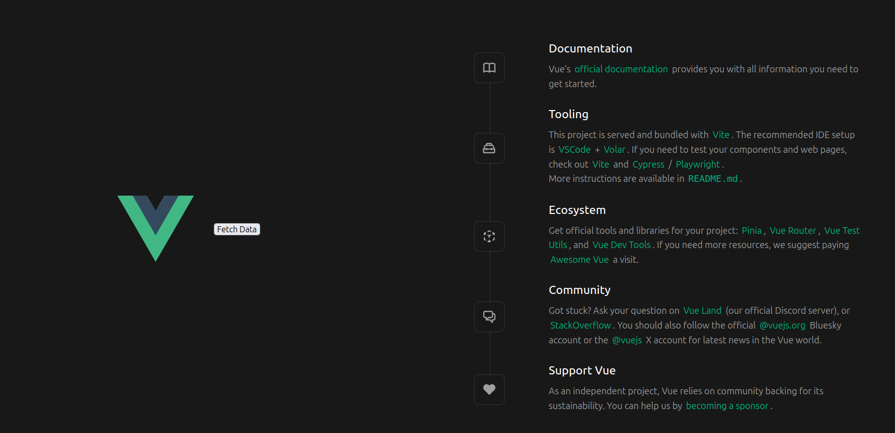
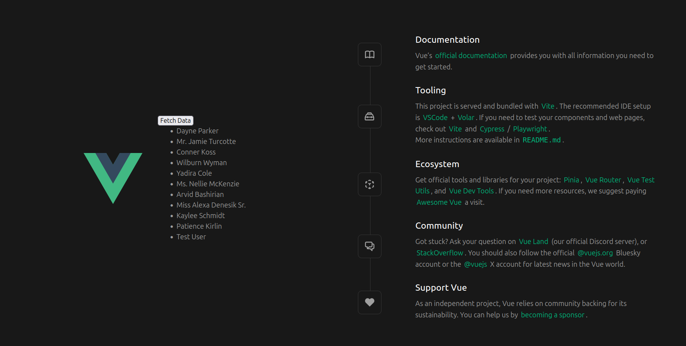
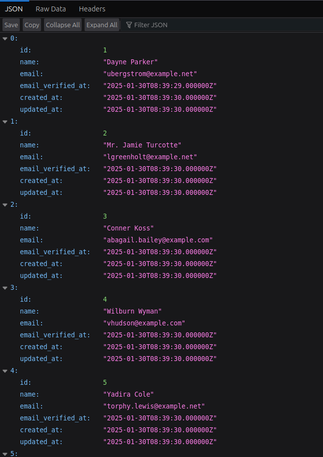
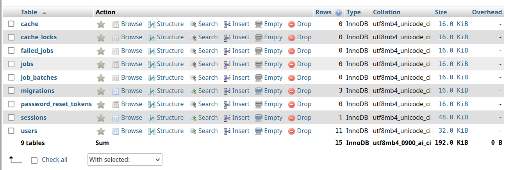

# Docker-based Presentation Project

This project sets up a multi-container environment using Docker Compose. It includes MySQL, phpMyAdmin, a backend service, a frontend service, and an Nginx server for handling requests.

## Prerequisites

- Docker installed ([Download here](https://www.docker.com/get-started))
- Docker Compose installed ([Guide here](https://docs.docker.com/compose/install/))

## Setup Instructions

### 1. Clone the Repository
```sh
git clone https://github.com/DanielFarag/dockerize-laravel-demo.git
cd dockerize-laravel-demo
```

### 2. Create a `.env` File

Create a `.env` file in the project root and define environment variables:
```
MYSQL_DATABASE=mydatabase
MYSQL_ROOT_PASSWORD=rootpassword
MYSQL_USER=myuser
MYSQL_PASSWORD=mypassword
MYSQL_ROOT_NAME=root
```

### 3. Build and Start Containers
```sh
docker-compose up -d --build
```
This will start all services in detached mode.

## Services Overview

### MySQL
- **Image:** `mysql:latest`
- **Container Name:** `presentation_mysql`
- **Persistent Volume:** `mysql-data`
- **Networks:** `database`, `backend`

### phpMyAdmin
- **Image:** `phpmyadmin:latest`
- **Container Name:** `presentation_phpmyadmin`
- **Port:** `8081` (Access via `http://localhost:8081`)
- **Depends on:** MySQL
- **Networks:** `database`

### Backend
- **Image:** `ghcr.io/danielfarag/project2-backend-laravel:latest`
- **Container Name:** `presentation_backend`
- **Depends on:** MySQL
- **Networks:** `backend`

### Frontend
- **Image:** `ghcr.io/danielfarag/project2-frontend-vue:latest`
- **Container Name:** `presentation_vue`
- **Depends on:** Backend
- **Persistent Volume:** `frontend-dist`
- **Networks:** `frontend`

### Nginx (Server)
- **Image:** `ghcr.io/danielfarag/project2-nginx:latest`
- **Container Name:** `presentation_nginx`
- **Port:** `80` (Access via `http://localhost`)
- **Depends on:** Frontend
- **Persistent Volume:** `frontend-dist`
- **Networks:** `frontend`, `backend`

## Stopping Containers
```sh
docker-compose down
```

## Accessing Services
- **phpMyAdmin:** `http://localhost:8081`
- **Frontend Application:** `http://localhost`

## Logs and Debugging
To view logs for a specific container:
```sh
docker logs -f <container_name>
```

## Screenshots
- Ensure `.env` variables are correctly set before running `docker-compose up`.
- Use `docker-compose down -v` to remove containers along with their volumes.

## Notes

## GET /



## GET /api/users


## phpmyadmin

